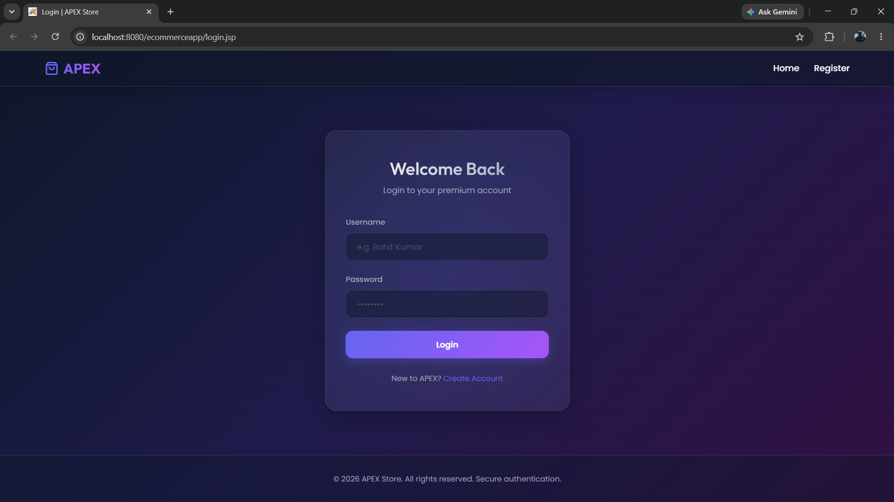
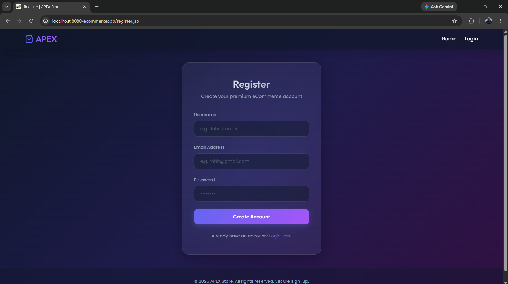
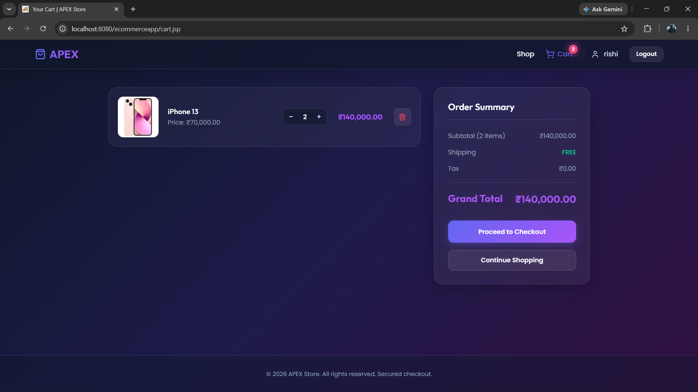

# E-Commerce Web Application (Java)

## Tech Stack
- Java Servlets, JSP
- JDBC, MySQL
- HTML, CSS
- Apache Tomcat

## Features
- User Login & Registration
- Product Listing (DB driven)
- Cart Management (Session-based)
- Logout with cache handling

## Setup
1. Import project in IntelliJ/Eclipse
2. Configure Tomcat server
3. Setup MySQL DB using provided SQL file
4. Run project

## Database Design
- Users → Stores user credentials
- Products → Stores product details
- Cart → Maps users with products (Many-to-Many relationship)

## Future Improvements
- Authentication Filter
- Password Encryption
- MVC Refactoring
- ## 📸 Screenshots

