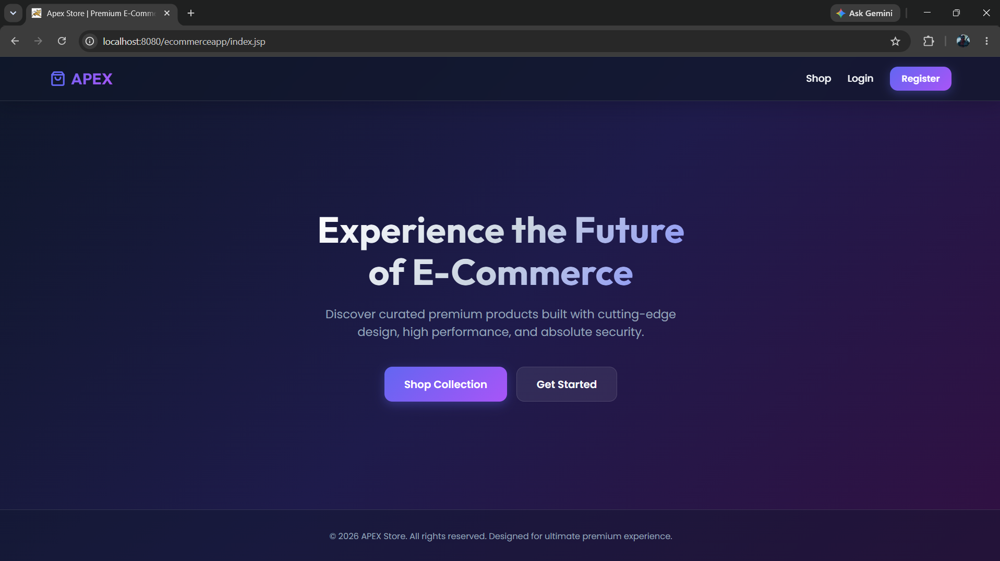
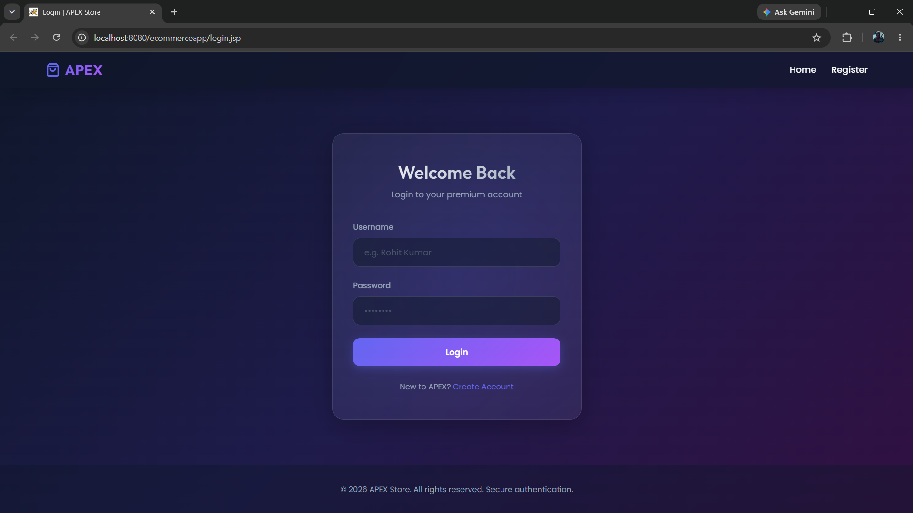
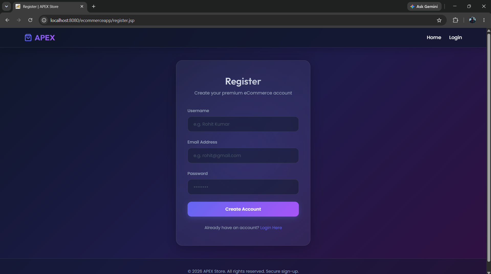
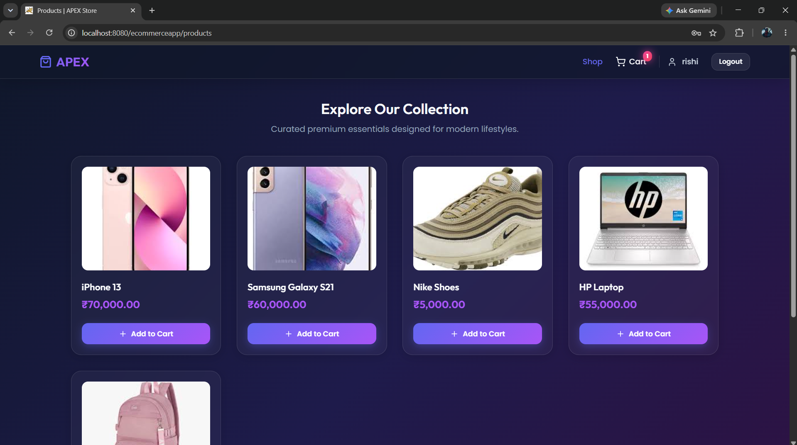
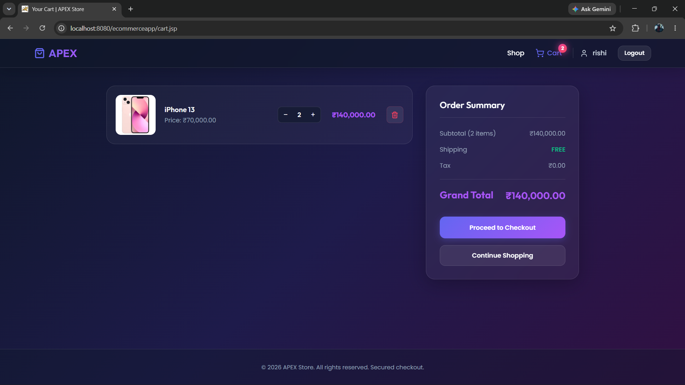

# E-Commerce Web Application (Java)

## Tech Stack
- Java Servlets, JSP
- JDBC, MySQL
- HTML, CSS
- Apache Tomcat & Docker

## Project Structure
```
Ecommerce/
│
├── src/            # Source code (Servlets, JSP, DAO, Controllers)
├── pom.xml         # Maven build configuration
├── target/         # Compiled output binaries (WAR package)
├── Dockerfile      # Multi-stage Docker build config
└── README.md       # Project documentation
```

## Features
- User Login & Registration
- Product Listing (DB driven)
- Cart Management (Session-based)
- Logout with cache handling

## Setup & Running

### Option 1: Docker (Recommended)
```bash
# Build Docker image
docker build -t ecommerceweb .

# Run Docker container
docker run -p 8080:8080 ecommerceweb
```

### Option 2: Local Server Setup
1. Import project in IntelliJ / Eclipse
2. Configure Tomcat server (Tomcat 10+)
3. Setup MySQL DB using provided `database.sql` file
4. Build with `mvn clean package` and deploy to Tomcat

## Database Design
- Users → Stores user credentials
- Products → Stores product details
- Cart → Maps users with products (Many-to-Many relationship)

## Future Improvements
- Authentication Filter
- Password Encryption
- MVC Refactoring

## 📸 Screenshots







